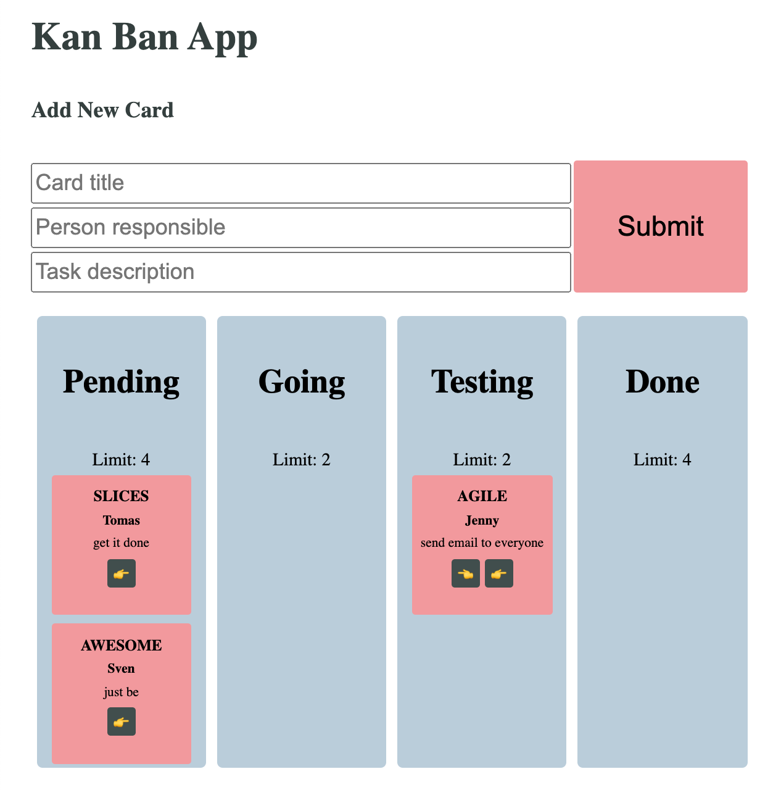
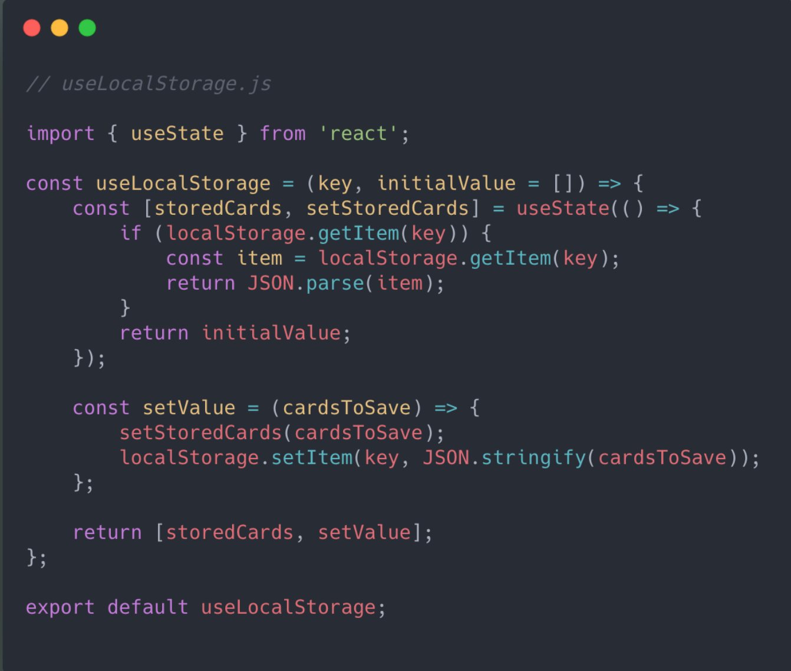

# Kanban - japanese task management tool
[Try it out!](https://mlvrkhn.github.io/kanban_task_management_app/)
 
  

## Project description

Build a task managing tool as an implementation of KanBan, the japanese scheduling system for lean management. Provide following features: add and move cards with tasks between columns, set maximum limits onto columns. Use local storage as a database to store planned tasks. Add user interface.

## Project Difficilties

- receive and validate user input, which is afterwards stored in browsers Local Storage,
- set automatic limits for number of tasks in colum,
- add error handling and present it to the user,
- state management with React Hooks.

## My solution

With the useage of modern React tools like hooks (useContext, useRef, useState) you are able to organize your workflow using the App, that will store you data in your browser.  
```const [getItem, setItem] = useStorage('name');```

## Notable features

- useContext hook to handle some data-flow within an app,
- take advantage of ES-lint tool and other libraries like Babel or Webpack,
- create custom hook that handles communication between the App and Local Storage

## Code samples  
### Local Storage Hooks
  

### Move Task Hook
  